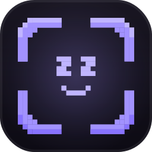

<p align="center">
  
</p>

<h1 align="center">Scrozz</h1>

<p align="center">
  A screenshot tool for <b>macOS</b>, <b>Windows</b>, and <b>Linux</b> — free, open source,
  and cross-platform from its first commit rather than as a later port.
</p>

<p align="center">
  <a href="LICENSE"></a>
  
  
  <a href=".github/workflows/ci.yml"></a>
  <a href="https://github.com/sponsors/thatcube"></a>
</p>

> ### 🚧 Early, and honest about it
>
> **Scrozz is not a released application yet.** There is no download, no
> installer, and no version you should rely on for daily work.
>
> On macOS it takes real screenshots today, from the menu bar and the command
> line. On **Windows and Linux there is substantial, compiling, CI-tested
> implementation — but no human has yet sat down and used Scrozz as an
> application on either.** Until someone has, this README will not call them
> supported. The [status table](#status) below is exact about which is which.

---

## What it is

Scrozz captures your screen and puts the result somewhere useful — on the
clipboard, in a file, or dragged straight into whatever app you are already
working in.

The part that makes it unusual is not the capture. It is that **the
cross-platform core existed in the first commit**, before any platform was
finished. macOS-first-then-port is how tools quietly become macOS-only: platform
assumptions get baked into the core long before anyone notices. So all three
backends compile on every push, and the interface is rendered and pixel-diffed
on all three in CI — the reasoning is in
[`docs/decisions.md`](docs/decisions.md) (D3) and the machinery in
[`docs/platforms.md`](docs/platforms.md).

macOS is polished first because it is the maintainer's daily driver, and
dogfooding is what actually gets an app finished.

## Status

Read this as a map of what is *proven*, not what is *planned*.

**Verification levels**

- ✅ **Works** — implemented, and used by a human on real hardware.
- 🟡 **Implemented, not confirmed by hand** — real code against the real platform
  API, covered by automated tests. On Windows and Linux that means it compiles
  for the target, links, and passes the suite on that platform's CI runner —
  **nobody has run it as an app.**
- 🟠 **Partial** — some of the pieces exist; the feature does not yet stand up
  end to end.
- ⬜ **Not started** — types and contracts only, or nothing at all.
- 🚫 **Not available, by design** — the platform genuinely cannot, and Scrozz
  says so rather than failing silently ([D8](docs/decisions.md)).

| Area | macOS | Windows | Linux | Notes |
|---|:--:|:--:|:--:|---|
| Screen / display capture | ✅ | 🟡 | 🟡 | ScreenCaptureKit · Windows.Graphics.Capture · X11 + desktop portal |
| Window & region capture | ✅ | 🟡 | 🟡 | Wayland cannot enumerate windows; the portal picker is used instead |
| Save, clipboard, encoding | ✅ | 🟡 | 🟡 | Shared, platform-agnostic code — one implementation, tested everywhere |
| Menu-bar / tray app | ✅ | 🟡 | 🟡 | One cross-platform tray item; only the macOS one has been run by a person |
| Global hotkeys | ✅ | 🟡 | 🟠 | Works where the desktop allows it. Wayland cannot grab keys, so Scrozz refuses and hands you the exact compositor config line to bind the CLI instead ([D11](docs/decisions.md)) |
| Capture stack overlay | ✅ | ⬜ | ⬜ | The native overlay window is retrofitted on macOS only; elsewhere it reports unsupported rather than silently doing nothing. GNOME/Wayland cannot position overlays at all — the adaptation is [D31](docs/decisions.md) |
| Drag-out to another app | 🟡 | ⬜ | ⬜ | The hero interaction ([D12](docs/decisions.md)): promised-file drag exists on macOS; other backends are planned, not written |
| Text recognition (OCR) | ✅ | 🟡 | 🚫 | On-device system engines: Vision · `Windows.Media.Ocr` · Linux ships none |
| Capture history | 🟠 | 🟠 | 🟠 | Local SQLite persistence and retention exist in `scrozz-store`; the `history` commands are not wired up yet |
| Command-line interface | ✅ | 🟡 | 🟡 | Every capture the app can take, headlessly ([D11](docs/decisions.md)) |
| Annotation editor | 🟠 | 🟠 | 🟠 | The document model and renderer exist; the editing interface does not |
| Screen recording | ⬜ | ⬜ | ⬜ | Contracts only. Hardware encoders only, for licence reasons |
| Scrolling capture | ⬜ | ⬜ | ⬜ | No clean implementation exists on any platform; deliberately deferred |

**What 🟡 rests on, precisely.** Three automated layers, described in full in
[`docs/platforms.md`](docs/platforms.md): every target type-checks from a single
machine; every push builds, links and tests on real macOS, Windows and Linux
runners; and the interface is *rendered headlessly and pixel-diffed* on all three,
which is why "does it look right on Windows" is not an unanswered question. What
none of that can prove is behaviour in a live desktop session — whether the
overlay steals focus mid-sentence, whether a hotkey survives a lock screen,
whether a permission dialog says something a person can act on. That is a real
gap, it is stated in `docs/platforms.md` as layer 4, and it is why Windows and
Linux are not called supported here.

**The road from 🟡 to ✅** runs through that layer 4: real desktop sessions on
each platform, a person driving the app, and the rough edges that only a live
session reveals fixed one at a time. The plan, the four layers, and the honest
account of where the asymmetry sits are all in
**[`docs/platforms.md`](docs/platforms.md)**.

## Using it today (macOS)

You will need [Rust](https://rustup.rs) 1.98 or newer. Full Xcode is optional —
it is used only to compile the layered macOS 26 app icon, and the build skips
that step cleanly without it.

```bash
git clone https://github.com/thatcube/scrozz.git
cd scrozz
tools/make-app-bundle.sh          # builds and installs /Applications/Scrozz.app
open /Applications/Scrozz.app
```

The bundle is not a convenience. macOS attaches a Screen Recording permission to
a *bundle identity*, so a bare binary run from a terminal has the grant land on
the terminal instead and capture is refused no matter how many times you approve
it. Build the app, approve it once in **System Settings → Privacy & Security →
Screen Recording**, and the grant sticks across rebuilds.

Scrozz then lives in the menu bar. It is invisible at rest by design
([D27](docs/decisions.md)) — the captures appear, the app does not.

Native recording probes are explicitly opt-in. The window-disappearance probe
uses a disposable window; microphone and interaction probes build a signed
helper app with the required privacy descriptions and may show system prompts.
Ordinary tests never run them:

```bash
SCROZZ_RECORD_WINDOW_SMOKE=1 tools/run-macos-recording-smoke.sh window-disappearance
tools/run-macos-recording-smoke.sh microphone-package # build/sign only; no prompt
SCROZZ_RECORD_MIC_SMOKE=1 tools/run-macos-recording-smoke.sh microphone
tools/run-macos-recording-smoke.sh interactions-package # build/sign only; no prompt
SCROZZ_RECORD_INTERACTION_SMOKE=1 tools/run-macos-recording-smoke.sh interactions
SCROZZ_PLAYBACK_SMOKE=1 tools/run-macos-playback-smoke.sh # plays a quiet A/V fixture
cargo run -p scrozz-record --example macos_export_smoke -- source.mp4 output.mp4
```

Recording interaction overlays are opt-in. `record.highlight-clicks` and
`record.show-keystrokes` trigger Input Monitoring only when a recording starts;
keystrokes default to `record.keystroke-scope=modifiers-only`. The `all` mode can
expose typed content and is presented with an explicit privacy warning. Scrozz
retains only display-ready labels in memory for an open editor session, never in
history, logs, or event sidecars.

### From the command line

The CLI is not a wrapper around the app; it is the same capability, headless, and
it is a stable contract ([D11](docs/decisions.md)). It is also how Scrozz gets
hotkeys on compositors that refuse to provide them.

```bash
cargo run -p scrozz -- list displays
cargo run -p scrozz -- list windows
cargo run -p scrozz -- capture --display primary -o shot.png
cargo run -p scrozz -- capture --region 0,0,1200,800 --json
cargo run -p scrozz -- ocr shot.png
cargo run -p scrozz -- settings get
cargo run -p scrozz -- --help
```

Commands that are not built yet say so and exit with a distinct status rather
than pretending — `history`, for instance, currently reports that it is not
implemented. Exit codes are part of the contract, so scripts can tell "no such
window" apart from "not implemented" apart from "permission denied".

Capture from a bare `cargo run` will be refused on macOS until you have built and
approved the app bundle above, for the permission reason described there. That
refusal is deliberate and tells you exactly which setting to change.

## Contributing & development

One script runs everything CI runs, with the same flags:

```bash
tools/dev.sh            # the full command list
tools/dev.sh check      # type-check for this machine
tools/dev.sh lint       # clippy, warnings denied
tools/dev.sh test       # the test suite
tools/dev.sh platforms  # type-check macOS + Windows + Linux, from any of them
tools/dev.sh golden     # headless golden-image tests
tools/dev.sh ci         # everything, in CI's order — the answer before pushing
```

`tools/dev.sh platforms` is the one worth knowing about: it type-checks the
Windows and Linux code against the genuine API surface without a Windows or Linux
machine, which turns most cross-platform mistakes into a compile error on your
own laptop instead of a CI round trip days later.

Before writing platform code, read
**[`docs/platforms.md`](docs/platforms.md)** — particularly the recorded gotchas,
several of which are APIs that return success while doing nothing at all.

**The documentation is the design.** Decisions are binding and written down
before implementation:

| Document | What it is |
|---|---|
| [`docs/decisions.md`](docs/decisions.md) | Every architectural decision (D1–D31), with the reasoning and what it rules out |
| [`docs/platforms.md`](docs/platforms.md) | The cross-platform strategy, the four verification layers, and what Windows and Linux still need |
| [`docs/feature-audit.md`](docs/feature-audit.md) | The authoritative feature inventory, per-platform feasibility, and the backlog |
| [`docs/research/`](docs/research) | The research the decisions were made from |
| [`AI_DISCLOSURE.md`](AI_DISCLOSURE.md) | How Scrozz is built, and what it does not do |
| [`TRADEMARK.md`](TRADEMARK.md) | What you may do with the name |

If you are changing behaviour, the decision record is the place to start. If a
decision is wrong, say so and change it there first — that is what it is for.

## Built with AI assistance, not powered by AI

A screenshot tool sees your screen, including things you never meant to share.
That earns a direct answer rather than a marketing adjective, so:

**Scrozz contains no AI.** No language model, no inference, nothing generated. It
does not upload your captures anywhere, has no telemetry, no analytics, no
account, no sign-in, and no server to talk to. There is nothing to monetise
because nothing leaves your machine. Text recognition runs on device, using the
recogniser already built into your operating system.

You can check that rather than believe it: **there is no HTTP client anywhere in
the dependency tree** — search `Cargo.lock` for `reqwest`, `hyper`, `ureq` or
`curl` and you will come up empty. An application that cannot make a web request
cannot phone home.

**Coding agents did assist with implementation.** Brandon Moore conceived Scrozz,
researched it, designed the product and its visual identity, made every
architectural decision, tested the results, branded it, and maintains it; agents
wrote code against decisions that were already made, and built the automated
checks that prove that code does what it claims. That arrangement was written
down as [D5](docs/decisions.md) before most of the code existed, alongside
[D25](docs/decisions.md), which exists for the blunt reason that *an agent cannot
see* — so every product image is generated by a headless harness and diffed by
the build, rather than trusted.

The full version, including how to verify each claim, is in
**[`AI_DISCLOSURE.md`](AI_DISCLOSURE.md)**.

## Origins

Scrozz began as a study rather than as code, and the repository's own history
shows it: the first commits are a feature audit, four research reports, and the
decision record — architecture, licensing, platform strategy and interaction
design were argued out and written down *before* the workspace existed at all.
Concept and research preceded implementation. How long they preceded it is not
recorded anywhere in this repository, so this README does not guess.

The first code lands afterwards, and the ordering is deliberate: the
cross-platform verification harness before the capture backends, the platform
backends before the interface, the interface before the app. The commit titled
*"Scrozz takes its first real screenshot"* comes only once all of that is
standing. Everything since has been macOS polish and cross-platform groundwork.

The whole design argument — including the decisions that were made, reversed, and
corrected along the way — is preserved in
[`docs/decisions.md`](docs/decisions.md). None of it was reconstructed after the
fact.

## Who makes Scrozz

**[Brandon Moore](https://brando.page)** — founder, product designer, researcher,
and maintainer. Scrozz is his: the idea, the research, the architecture, the
visual identity and icon, the testing, and the decisions about what ships. Every
commit in this repository is authored by him, which you can confirm with
`git shortlog -sne`.

Contributions are welcome. The design decisions in
[`docs/decisions.md`](docs/decisions.md) are binding, and the fastest way to get a
change merged is to say which decision it serves — or which one it means to
revisit.

## Reporting bugs & requesting features

Please [open an issue](https://github.com/thatcube/scrozz/issues). Your operating
system and version, your desktop environment on Linux, and what you expected to
happen all help a great deal.

Screenshots often contain more than you intend — check yours before attaching it,
and never paste credentials or tokens into an issue.

## Donate

Scrozz is free and open source, with no paid features, no paywall, and no ads. If
it turns out to be useful to you and you would like to chip in toward its upkeep,
donations are welcome and genuinely appreciated. Anything is plenty, and not
donating is completely fine.

**[Donate via GitHub Sponsors](https://github.com/sponsors/thatcube)** — one-time
or recurring.

## Licence & trademark

[GPL-3.0, with a store-distribution exception](LICENSE) © 2026 Brandon Moore.

The licence covers the **code**, and the freedom to use, change, and sell it is
the point. It does not cover the **name**: "Scrozz" and the Scrozz logo are
trademarks, so a modified version needs a different name. The reasoning, and
exactly what you may do without asking, is in
[`TRADEMARK.md`](TRADEMARK.md).

Other products named anywhere in `docs/` are the trademarks of their owners,
referred to descriptively for comparison only ([D24](docs/decisions.md)).

## The family

Scrozz is one of a set of free, open-source apps by Brandon Moore. Same
principles throughout: your data stays yours, nothing is monetised, and nothing
is hidden behind an account.

| App | What it does |
|---|---|
| **[Hozz](https://github.com/thatcube/hozz)** | Apple Health, exported to storage you own |
| **[Mozz](https://github.com/thatcube/Mozz)** | Your music, wherever it lives |
| **[Plozz](https://github.com/thatcube/Plozz)** | Movies & TV on Apple TV, iPhone & iPad |
| **[Twozz](https://github.com/thatcube/Twozz)** | Twitch on Apple TV, with real emotes |
| **Scrozz** | Screenshots on macOS, Windows & Linux — you are here |

<!-- app-family:start -->
<!-- Generated by https://github.com/thatcube/brando — edit apps.json there, not this block. -->

---

<p align="center"><b>More open source</b></p>

<p align="center">
  <a href="https://github.com/thatcube/hozz" title="Hozz — Apple Health, exported to storage you own"><picture><source media="(prefers-color-scheme: dark)" srcset="https://raw.githubusercontent.com/thatcube/brando/main/logos/lockups/hozz-dark.svg" /></picture></a>
  &nbsp;&nbsp;&nbsp;&nbsp;&nbsp;&nbsp;
  <a href="https://github.com/thatcube/Mozz" title="Mozz — Your music, wherever it lives"><picture><source media="(prefers-color-scheme: dark)" srcset="https://raw.githubusercontent.com/thatcube/brando/main/logos/lockups/mozz-dark.svg" /></picture></a>
  &nbsp;&nbsp;&nbsp;&nbsp;&nbsp;&nbsp;
  <a href="https://github.com/thatcube/Plozz" title="Plozz — Movies &amp; TV on Apple TV, iPhone &amp; iPad"><picture><source media="(prefers-color-scheme: dark)" srcset="https://raw.githubusercontent.com/thatcube/brando/main/logos/lockups/plozz-dark.svg" /></picture></a>
  &nbsp;&nbsp;&nbsp;&nbsp;&nbsp;&nbsp;
  <a href="https://github.com/thatcube/Twozz" title="Twozz — Twitch on Apple TV, with real emotes"><picture><source media="(prefers-color-scheme: dark)" srcset="https://raw.githubusercontent.com/thatcube/brando/main/logos/lockups/twozz-dark.svg" /></picture></a>
</p>

<p align="center">
  <a href="https://brando.page">
    <picture>
      <source media="(prefers-color-scheme: dark)" srcset="https://raw.githubusercontent.com/thatcube/brando/main/logos/brando-white.svg" />
      
    </picture>
  </a>
</p>
<!-- app-family:end -->
