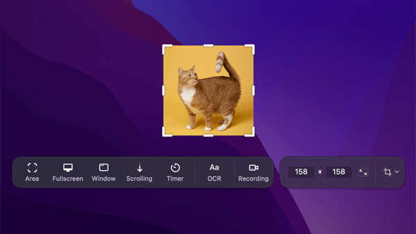

# Scrozz Feature Audit

**Purpose:** define "done" for Scrozz. This document is the authoritative feature inventory,
the cross-platform feasibility analysis, and the build backlog.

> **Scope note (D24).** This file and the public comparison page are the **only** places
> competitor names appear. Everything downstream — issues, code, commit messages, UI copy,
> store listings — refers to features by **their Scrozz names**. The bar being matched here
> is CleanShot X (macOS, $29); the goal is not to copy it but to beat it on three platforms.

**Sources:**
- `https://cleanshot.com/features` (rendered 2026-08-26) — authoritative, all 12 categories
- **Live CleanShot X 4.8.10 UI** — full settings surface, editor, and overlays,
  captured 2026-08-26. See the reference library below.
- `lzhgus/Capso` README — the closest existing OSS attempt (macOS-only, Swift 6, **BSL 1.1**)

**UI reference library:** `~/.copilot/scrozz-ui-reference/` (start at `INDEX.md`).
The complete library stays outside the repository. D17 permits a narrowly scoped,
user-supplied image under `docs/reference/` when the audit needs concrete visual
evidence for one behavior; it remains documentation, never a Scrozz product asset.

**Scope:** Scrozz targets macOS, Windows, and Linux. CleanShot is macOS-only, so every feature
below carries a per-platform feasibility note. That column, not the feature list, is what
determines the architecture.

---

## Legend

**Difficulty** (per platform, assuming competent agent implementation):
- `S` — small, well-trodden API call
- `M` — medium, real work but no unknowns
- `L` — large, multi-week equivalent, integration-heavy
- `XL` — research required, no clean API, likely per-environment hacks

**Tier:**
- `T0` — MVP. Without this it is not a screenshot app.
- `T1` — Parity core. This is why people pay for CleanShot.
- `T2` — Parity polish. Noticeable absence, not a blocker.
- `T3` — Long tail / differentiator.

---

## 1. Screenshots (capture modes)

| ID | Feature | Tier | macOS | Windows | Linux (X11) | Linux (Wayland) |
|---|---|---|---|---|---|---|
| CAP-01 | Capture area (drag select) | T0 | S | S | S | M |
| CAP-02 | Capture fullscreen | T0 | S | S | S | M |
| CAP-03 | Capture window (click a window) | T0 | S | M | M | **XL** |
| CAP-04 | Scrolling capture (stitched long capture) | T1 | L | L | L | **XL** |
| CAP-05 | Self-timer | T0 | S | S | S | S |
| CAP-06 | Multi-display / mixed-DPI correctness | T0 | M | M | M | M |
| CAP-07 | Retina/HiDPI scaling on output | T1 | S | S | S | S |
| CAP-08 | PixelSnap integration (measure tool) | T3 | — | — | — | — |

### All-in-One capture reference

The user-supplied CleanShot X reference below records the interaction category
Scrozz's All-in-One surface must cover: one temporary selector that can switch
among area, window, display, and all-display targets without returning to the
menu. It is behavioral audit evidence, not a Scrozz layout or styling template.

Scrozz keeps its own visual language. The required behavior is a dimmed
All-in-One workspace with a mode HUD; direct Capture Area remains visually quiet
and never dims pixels outside the selected region.

**Window screenshot options (CleanShot):** with background, adjustable padding, desktop
background / custom image / plain color / transparent, shadow on/off.

| ID | Feature | Tier | Notes |
|---|---|---|---|
| CAP-10 | Window capture with background fill | T2 | Compositing, platform-agnostic once you have the frame |
| CAP-11 | Adjust padding | T2 | Pure compositing |
| CAP-12 | Background = desktop / custom image / solid color / transparent | T2 | "Desktop" source needs wallpaper path per platform |
| CAP-13 | Window shadow toggle | T2 | macOS gives shadow free; Windows/Linux must synthesize |

### Advanced capture modes

| ID | Feature | Tier | macOS | Windows | Linux (X11) | Linux (Wayland) |
|---|---|---|---|---|---|---|
| CAP-20 | Show crosshair | T1 | S | S | S | S |
| CAP-21 | Show magnifier (pixel-accurate loupe) | T1 | M | M | M | M |
| CAP-22 | Freeze screen during selection | T1 | M | M | M | M |

> **Freeze screen** is the sleeper feature that makes capturing menus/tooltips possible. Implement
> as: grab a full-res frame → display it in a fullscreen always-on-top borderless window → run
> selection against the still image. Same technique on all three platforms.

---

## 2. Screen recording

| ID | Feature | Tier | macOS | Windows | Linux (X11) | Linux (Wayland) |
|---|---|---|---|---|---|---|
| REC-01 | Record area / window / fullscreen | T1 | M | M | M | M |
| REC-02 | MP4 (H.264) output | T1 | S | S | M | M |
| REC-03 | GIF output | T1 | M | M | M | M |
| REC-04 | Quality / FPS / resolution controls | T1 | S | S | S | S |
| REC-05 | Record microphone | T1 | S | S | S | S |
| REC-06 | Record system/computer audio | T1 | M | M | **L** | M |
| REC-07 | Auto-enable Do Not Disturb while recording | T2 | M | M | **XL** | **XL** |
| REC-08 | Show/hide cursor | T1 | S | S | S | M |
| REC-09 | Recording time in menu bar / tray | T2 | S | S | M | M |
| REC-10 | **Hide desktop icons** | **T1** | M | M | **XL** | **XL** |

> **REC-10 upgraded from T2.** Maintainer calls this out as a favourite feature.
> In CleanShot it is both an automatic behaviour during capture *and* a standalone
> menu-bar toggle, and it appears in first-run onboarding — so it is a visible,
> daily-value feature rather than a recording-only detail. macOS: `CreateDesktop`
> default plus a Finder restart. Windows: toggle the desktop `SysListView32`.
> Linux: desktop icons are drawn by the DE (GNOME extension, Plasma desktop
> containment, Nautilus), so there is no portable mechanism — expect per-DE
> support or none.

### Recording overlays

| ID | Feature | Tier | Notes |
|---|---|---|---|
| REC-20 | Capture clicks (visual click highlights) | T1 | Needs global mouse monitoring: mac Accessibility perms, Win low-level hook, X11 XInput2, **Wayland has no portable global input monitoring** |
| REC-21 | Click color / size / style (outline vs filled) / animation toggle | T2 | Pure rendering once REC-20 works |
| REC-22 | Capture keystrokes (on-screen key display) | T1 | Same permission problem as REC-20, worse — this is a keylogger API surface |
| REC-23 | Keystroke position / size / dark-light style / all-keys vs modifiers-only | T2 | Pure rendering |
| REC-24 | Record camera (webcam PiP) | T1 | Uniform: mac AVFoundation, Win Media Foundation, Linux V4L2 |
| REC-25 | Camera position / size / shape | T2 | Rendering |
| REC-26 | Camera fullscreen (presenter) mode | T2 | Rendering |

### Video editor

| ID | Feature | Tier | Notes |
|---|---|---|---|
| VID-01 | Trim | T1 | ffmpeg-class operation |
| VID-02 | Change quality | T1 | Re-encode |
| VID-03 | Change resolution | T2 | Re-encode |
| VID-04 | Stereo → mono audio | T3 | Re-encode |
| VID-05 | Adjust volume / mute | T2 | Re-encode |
| VID-06 | Playback of recorded video in-app | T1 | Needs a video surface in whatever UI stack you choose |

---

## 3. Annotate (the editor)

**Character of the feature:** CleanShot's editor is the differentiator. Native look, fast, and
non-destructive. This is the single largest surface area in the product.

### Tools

| ID | Tool | Tier | Notes |
|---|---|---|---|
| ANN-01 | Crop — with aspect ratio + snap to edges | T0 | |
| ANN-02 | Arrow — **4 styles including curved** | T0 | **Implemented:** Bold, Curved, Sketch, and Double; four named thickness presets backed by numeric source-unit width; deterministic Sketch seed; hybrid bend affordance |
| ANN-03 | Rectangle | T0 | |
| ANN-04 | Filled rectangle | T0 | |
| ANN-05 | Ellipse | T0 | |
| ANN-06 | Line | T0 | |
| ANN-07 | Pixelate — **with randomization** (anti-unpixelate) | T1 | Randomization is a real security property, not decoration |
| ANN-08 | Blur — secure + smooth modes | T1 | "Secure" = irreversible, not a reversible gaussian |
| ANN-09 | Spotlight (dim everything else) | T1 | |
| ANN-10 | Counter (numbered step markers) | T1 | Auto-increment, reorderable |
| ANN-11 | Pencil / freehand — **auto-smoothing** | T1 | Curve fitting, not raw point dump |
| ANN-12 | Highlighter | T1 | Multiply blend |
| ANN-13 | Text tool — **7 predefined styles** | T0 | Text layout + editing is deceptively expensive |
| ANN-14 | **Redact tool** (shortcut `P`) — separate from blur/pixelate, with a strength slider | **T1** | **Not on the features page; found in the live UI.** Maintainer specifically loves this one. Distinct from blur: redaction must be *irreversible by construction* |

### Editor capabilities

| ID | Feature | Tier | Notes |
|---|---|---|---|
| ANN-20 | Combine multiple images into one (drag & drop to compose) | T2 | |
| ANN-21 | Editable project file format (`.cleanshot` equivalent) | T1 | Implies a serialized document model; **decide this before writing the editor** |
| ANN-22 | Undo / redo | T0 | Falls out of a document model, painful to retrofit |
| ANN-23 | Native look and feel per platform | T1 | **This is the core cross-platform tension** |
| ANN-24 | Dark / light mode | T1 | |
| ANN-25 | "Drag me" button (drag capture into another app without saving) | T1 | Platform drag-source APIs; Wayland DnD is portal-mediated |
| ANN-26 | Many sharing options | T2 | |

---

## 4. Background tool (beautify)

| ID | Feature | Tier | Notes |
|---|---|---|---|
| BG-01 | Add background to screenshot | T2 | |
| BG-02 | 10 built-in backgrounds | T2 | Need originals — do not ship copies of theirs |
| BG-03 | Custom background image | T2 | |
| BG-04 | Padding | T2 | |
| BG-05 | Alignment options | T2 | |
| BG-06 | **Auto Balance** (auto-centers on visual content) | T3 | Content-aware trim/centering; genuinely clever |
| BG-07 | Aspect ratio presets (social sizes) | T2 | |

---

## 5. Recent Captures Overlay

The post-capture floating thumbnail. Small surface, enormous share of daily-use satisfaction.

> **Corrected 2026-08-26.** The first pass of this audit under-rated this section
> badly. Maintainer feedback: *"you can swipe the screenshots that stack in the
> bottom right down, and also drag them into a chat or wherever you want to send
> them — which is SICK core functionality, almost more intuitive than copying to
> clipboard."* Drag-out is a **hero interaction, not a convenience**, the overlay
> is a **stack** rather than a single card, and swipe-to-dismiss is a primary
> gesture. Tiers below reflect the correction.

| ID | Feature | Tier | Notes |
|---|---|---|---|
| QA-01 | Post-capture floating overlay | T0 | |
| QA-02 | Copy / save / annotate from overlay | T0 | |
| QA-03 | **Drag & drop to any app** | **T0** | Hero interaction. See QA-14 — this is harder than it looks |
| QA-04 | Display file information | T2 | |
| QA-05 | Restore recently closed overlay | T2 | |
| QA-06 | Adjust position on screen | T2 | |
| QA-07 | Adjust overlay size | T2 | |
| QA-08 | Configurable auto-close behavior | T1 | |
| QA-09 | Multi-display support | T1 | |
| QA-10 | **Swipe-to-dismiss gesture** | **T1** | Previously mis-tiered T3. Primary dismissal on macOS; needs a non-trackpad equivalent on Windows/Linux |
| QA-11 | Quick actions | T2 | |
| QA-12 | Temporarily hide overlays | T2 | |
| QA-13 | **Recent captures — multiple captures stacked in the corner** | **T0** | **Implemented:** adaptive 288×180 logical 16:10 cards, cover-fill previews, and work-area-derived capacity with no fixed item-count cap |
| QA-14 | **Promised-file drag (drag out before saving)** | **T0** | The technical core of QA-03 — see below |

> **QA-14 is the sleeper cost in this section.** Dragging a capture that has never
> been written to disk requires *promised file* drag on every platform, and the
> API is different everywhere: `NSFilePromiseProvider` on macOS,
> `CFSTR_FILEDESCRIPTOR` / delayed rendering on Windows, and XDND with
> `text/uri-list` plus a temp file on Linux (portal-mediated under Wayland).
> Budget this as real per-platform work, not a toolkit checkbox.

---

## 6. Floating / pinned screenshots

| ID | Feature | Tier | macOS | Windows | Linux (X11) | Linux (Wayland) |
|---|---|---|---|---|---|---|
| PIN-01 | Pin screenshot to screen | T1 | S | S | S | M |
| PIN-02 | Always on top | T1 | S | S | S | **M/XL** (compositor-dependent) |
| PIN-03 | Adjust size & opacity | T2 | S | S | S | S |
| PIN-04 | Arrow-key positioning | T3 | S | S | S | **XL** (no client window positioning) |
| PIN-05 | Lock mode (click-through) | T2 | S | S | S | M |

> Wayland forbids clients setting their own position and generally their own stacking. PIN-02/04
> are the clearest example of a feature that is trivial on 3 of 4 targets and hostile on the 4th.

---

## 7. Text recognition (OCR)

| ID | Feature | Tier | Notes |
|---|---|---|---|
| OCR-01 | Select area → text to clipboard | T1 | |
| OCR-02 | **On-device only** (privacy) | T1 | macOS Vision; Windows `Windows.Media.Ocr`; Linux Tesseract. Three engines, three quality profiles — or one bundled engine everywhere for consistency |
| OCR-03 | Works on images, video frames, scanned docs | T1 | Falls out of OCR-01 |
| OCR-04 | **QR codes and barcodes** | T1 | **Newly identified.** The competitor's own onboarding sells the tool as copying text "from images, videos, PDFs, webpages, photos **and even QR codes**". A QR in a screenshot is a URL the user cannot click, and retyping it is not an option — so this is closer to essential than to a bonus. macOS `VNDetectBarcodesRequest` gives it almost free alongside Vision text; Windows has no system barcode API, so `rxing` (pure-Rust ZXing port) or `rqrr` covers Windows and Linux together. Should return the payload *and* its bounds, so the UI can indicate what it found |
| OCR-05 | Recognise text the pointer is over, without selecting | T2 | Live text under cursor, rather than drag-a-region first |

### Onboarding pattern worth stealing

The competitor introduces this tool with a **one-time, two-panel dialog**: a
sentence saying what it does, two captioned illustrations (*1. Select area with
text* → *2. Paste the text*), and a single "Got it!" button. Reference:
`cleanshot/onboarding-text-recognition.png`.

It is worth copying the *shape* because it matches D26 exactly: it teaches only
the thing the interface cannot teach itself — that a selection becomes clipboard
text — and it costs one sentence and two pictures. Under D25 those two panels are
**generated from the real UI**, so they cannot drift from the product.

The same pattern applies to the one feature Scrozz most needs to explain, which
is **drag-out** (D12): *1. Take a capture* → *2. Drag it straight into another
app*. Nothing on screen announces that, and it is the hero action.

---

## 8. All-In-One mode

| ID | Feature | Tier | Notes |
|---|---|---|---|
| AIO-01 | Single shortcut → HUD exposing every capture mode | T1 | Capso already proves this UX works |
| AIO-02 | Specify exact size | T1 | |
| AIO-03 | Lock aspect ratio | T1 | |
| AIO-04 | Remembers last selection (retake) | T1 | High-value, low-cost |

---

## 9. Capture history

| ID | Feature | Tier | Notes |
|---|---|---|---|
| HIS-01 | Browse recent captures | T1 | |
| HIS-02 | Restore a capture | T1 | |
| HIS-03 | Delete from history | T1 | |
| HIS-04 | Filter by capture type | T2 | |
| HIS-05 | Retention window (CleanShot: up to 1 month) | T2 | |

---

## 10. Cloud

CleanShot Cloud is a hosted service and a **revenue model**. Scrozz is free and open source, so
this category must be re-scoped, not cloned. Capso's answer — bring-your-own S3/R2 — is the
correct shape.

| ID | Feature | Tier | Notes |
|---|---|---|---|
| CLD-01 | Upload capture, get shareable link | T2 | BYO storage (S3/R2/B2/generic S3) |
| CLD-02 | Self-destruct / expiry | T3 | Requires server logic or object lifecycle rules |
| CLD-03 | Password-protected links | T3 | Requires a server or a viewer page |
| CLD-04 | Tags / organization | T3 | |
| CLD-05 | Custom domain & branding | T3 | Free with BYO bucket |
| CLD-06 | Team management | — | **Explicit non-goal** |
| CLD-07 | Cloud is optional, app fully functional without it | T0 | Hard requirement |

---

## 11. Settings & system integration

| ID | Feature | Tier | macOS | Windows | Linux (X11) | Linux (Wayland) |
|---|---|---|---|---|---|---|
| SYS-01 | Global keyboard shortcuts (fully configurable) | T0 | M | M | M | **L** (GlobalShortcuts portal, recent + uneven) |
| SYS-02 | Menu bar / system tray presence | T0 | S | S | M | M |
| SYS-03 | Launch at login | T1 | S | S | M | M |
| SYS-04 | Configurable save location / filename templates | T0 | S | S | S | S |
| SYS-05 | Output formats (PNG/JPG/etc.) | T0 | S | S | S | S |
| SYS-06 | Copy to clipboard on capture | T0 | S | S | S | M |
| SYS-07 | "Adjust nearly every behavior" — deep preferences | T1 | M | M | M | M |
| SYS-08 | Permission onboarding flows | T0 | M | S | S | M |
| SYS-09 | URL scheme API (automation) | T3 | S | M | M | M |
| SYS-10 | Auto-update | T1 | M | M | M (AppImage/Flatpak differ) | M |

---

## 12. Cross-platform reality check

The three hardest structural problems, ranked. These decide the architecture; nothing in the
feature list does.

### 12.1 Wayland is a different product

Roughly a third of the feature list is either impossible or portal-mediated on Wayland:
window enumeration/picking (CAP-03), global hotkeys (SYS-01), global input monitoring for
click/keystroke overlays (REC-20/22), client-side window positioning and always-on-top
(PIN-02/04), scrolling capture's input synthesis (CAP-04), hiding desktop icons (REC-10).

Every capture on Wayland goes through `xdg-desktop-portal` + PipeWire, which means a permission
dialog per session unless a restore token is used. There is no "just take a screenshot" path.

**This is a scope decision, not an engineering problem.** Options: (a) X11-only Linux at v1,
(b) Wayland with a documented reduced feature set, (c) ship a compositor-specific path for
GNOME/KDE only.

### 12.2 "Native look and feel" versus one codebase

CleanShot's most-cited quality is that it feels like a Mac app. Capso's pitch is explicitly
"Native Swift, not Tauri." A single cross-platform UI toolkit is the only way three platforms
get built by a small effort — and it is also the thing that makes an app feel non-native.

The annotation editor is a custom canvas, so it is toolkit-agnostic and can be excellent
anywhere. The chrome around it (menus, preferences, overlays, tray) is where nativeness is
judged. A plausible split: **shared Rust/C++ core + custom-drawn editor canvas + thin
per-platform shell.** That is a real architecture decision to make deliberately.

### 12.3 Scrolling capture has no clean implementation anywhere

CleanShot's works "nearly in every app" because it scrolls the target and stitches frames with
overlap detection. That requires synthesizing scroll input into a foreign window, capturing
frames, and image-matching the seams. Every platform makes the input-synthesis part
awkward and Wayland makes it hostile. Budget this as its own project, not a checkbox.

---

## 13. Prior art: Capso

`lzhgus/Capso` is the nearest OSS attempt and worth studying — modular SPM design (CaptureKit,
AnnotationKit, OCRKit, RecordingKit, EffectsKit, ExportKit, EditorKit, HistoryKit, ShareKit,
TranslationKit).

Two facts that constrain reuse:

1. **macOS-only by construction.** Swift 6 + ScreenCaptureKit + Vision + AppKit. Nothing in the
   capture, OCR, or recording layer ports to Windows or Linux.
2. **Licensed BSL 1.1, not open source.** Forking and shipping a *free* derivative is permitted,
   but the code does not become Apache 2.0 until three years after each release, and BSL code
   cannot be relicensed into an MIT/Apache project. **Copying Capso source into Scrozz would make
   Scrozz non-OSI-open-source until 2029.** Read it for design, do not paste it.

Capso ships features CleanShot does not: capture-and-translate, visual OCR with clickable
regions, recording-editor zoom suggestions and cursor smoothing.

---

## 14. Settings surface — full inventory

Derived from the live CleanShot X 4.8.10 preferences window (10 tabs). The
features page advertises ~50 features; the settings surface reveals roughly
twice that in configurable behaviour. **Much of what makes CleanShot feel
finished lives here, not on the marketing page.**

Screenshots: `~/.copilot/scrozz-ui-reference/cleanshot/settings/`

### Newly discovered — absent from the features page

| ID | Feature | Tier | Notes |
|---|---|---|---|
| NEW-01 | **Redact tool** (`P`) with strength slider | T1 | Separate tool from blur/pixelate — see ANN-14 |
| NEW-02 | **Non-destructive crop** with "Revert to Original" | T1 | Crop is a document operation, not a pixel operation. Falls out of D14's retained model **only if designed in from the start** |
| NEW-03 | Crop: snap to edges (⌘ to disable), rotate, flip, numeric W×H, live image size | T2 | |
| NEW-04 | **Canvas auto-expand** — canvas grows so annotations placed outside the image still fit | T2 | Genuinely clever; changes how the document model handles bounds |
| NEW-05 | **Show colour names** (accessibility option in Annotate) | T2 | Direct support for D13 — colour must never be the sole carrier of meaning |
| NEW-06 | Draw shadow on annotation objects | T2 | |
| NEW-07 | Inverse arrow direction (⌥ to invert while drawing) | T3 | |
| NEW-08 | **Convert to sRGB profile** on export | T2 | Colour management. Captures from P3 displays look wrong pasted into non-managed apps — a real bug class |
| NEW-09 | Add 1px border to all screenshots | T3 | |
| NEW-10 | **`@2x` filename suffix for Retina captures** | T2 | Improves how other apps display HiDPI screenshots |
| NEW-11 | **Clipboard mode: "File & Image"** (configurable) | T1 | **Independent confirmation of D10.** CleanShot puts *both* a file reference and image data on the clipboard, and exposes the choice because some apps and clipboard managers mishandle one or the other |
| NEW-12 | Pinned screenshot chrome: rounded corners / shadow / border toggles | T2 | |
| NEW-13 | **Keep history: Never / 1 day / 3 days / 1 week / 1 month** | T1 | Prior art for the retention decision |
| NEW-14 | OCR: language selection + auto-detect, keep line breaks, **detect links** | T2 | |
| NEW-15 | **URL scheme API with a master on/off toggle** | T3 | Automation is opt-in — a good security default worth copying |
| NEW-16 | Dim screen while recording | T2 | Focuses attention on the recorded region |
| NEW-17 | Show countdown before recording | T2 | |
| NEW-18 | Remember last recording selection | T2 | |
| NEW-19 | Recent Captures Overlay: **close after dragging** (⌥ to keep) | T1 | Directly serves D12's drag-first model |
| NEW-20 | Recent Captures Overlay: save-button behaviour — export location, or ⌥ to choose | T2 | |
| NEW-21 | Recent Captures Overlay: position on screen, move to active display, overlay size | T2 | |
| NEW-22 | History: **source-app icon badge per capture** | T2 | "Which app was this from" is often how you find a capture again |
| NEW-23 | History: filmstrip layout, All / Screenshots / Videos / GIFs filters, relative timestamps | T1 | |
| NEW-24 | Ask for filename after every capture | T3 | |
| NEW-25 | Filename template editor | T2 | |
| NEW-26 | Usage statistics opt-in | — | **Non-goal.** Scrozz collects nothing |

### Modifier-key conventions worth stealing

CleanShot hides power behind modifiers instead of adding more settings:

- **⇧ while capturing a window** → transparent background instead of wallpaper
- **⌥ while capturing a window** → disable shadow
- **⇧ while capturing** → bypass the background-tool preset
- **⌥ while dragging from the overlay** → keep the item instead of closing
- **⌘ while cropping** → disable edge snapping
- **⌥ while drawing an arrow** → invert direction
- **⌥ on the save button** → choose destination

This is a design principle, not a feature list: **the default does the common
thing; a modifier does the opposite; no configuration required.** Adopt it.

### Shortcut granularity

The Shortcuts tab shows CleanShot binds *composite actions*, not just modes:

- Capture Area & Copy to Clipboard
- Capture Area & Save
- **Capture Previous Area** — re-shoot the last region without reselecting
- **Restore Last Capture** — bring back the overlay you just dismissed
- Hide Desktop Icons
- Capture History…

> **Implication for Scrozz.** These map one-to-one onto D11's CLI: every
> composite action is a CLI invocation with flags, and a keybinding is just a way
> to run it. Designing the CLI command grammar first yields the shortcut list for
> free — and on wlroots Linux, where no `GlobalShortcuts` portal exists, this is
> literally the only mechanism available.

### The Background/beautify panel in detail

Far richer than the features page implies
(`editor/background-tool-panel.png`):

- **Presets** — saveable, with `+` to add; appliable to all screenshots via Settings
- **Gradients** — ~20 built in, collapsible
- **Wallpapers** — your actual desktop wallpaper, plus custom images
- **Blurred** — blurred wallpaper, blurred white, blurred grey
- **Plain colour** — 18 swatches, custom picker, transparent
- **Padding**, **Inset**, **Shadow**, **Corners** — independent sliders
- **Auto-balance** toggle
- **Alignment** — 3×3 grid
- **Ratio** — aspect presets for social

Note that **corner radius is a slider on the beautify panel**, not a fixed
style. That is plausibly how CleanShot gets consistently correct rounded corners
where Capso does not (D9) — the radius is an explicit parameter of the document,
never a guess about the source window.

---

## 15. Beyond parity (candidate differentiators)

Parity alone gives no reason to switch. Candidates, none committed:

- **True cross-platform** — no competitor does macOS + Windows + Linux well. This is the whole thesis.
- **Genuinely free and OSI-licensed** — CleanShot $29, Cap $58, Shottr $8, Capso BSL.
- **The capture dock** — swipe the capture list down and it collapses into a small
  chevron'd bar at the screen corner; click or swipe up to bring it back. CleanShot
  offers "temporarily hide overlays" as a settings toggle, not a spatial,
  reversible, one-gesture affordance. See `decisions.md` D20.
- **Annotations that are never permanent** — history persists the full editable
  document, so any past capture reopens with its annotations live. No project
  files to manage, which is strictly better than CleanShot's `.cleanshot` format.
- **Scriptable/CLI-first** — a headless `scrozz capture --area ... --out ...` makes the app
  automatable and, critically, testable in CI.
- **Sync across machines via BYO storage** — settings and history, no vendor account.
- **Family integration** — shared design language and shared infrastructure with Plozz / Mozz / Hozz / Twozz.

---

## 16. Open questions (for the design review)

1. Which platform ships first, and is Linux X11-only at v1?
2. One UI toolkit or per-platform shells?
3. What is the document model for the annotation editor, and is the project file format v1?
4. Is scrolling capture in v1, or deferred behind everything else?
5. Do click/keystroke overlays justify shipping global input monitoring (and the permission
   scare + platform review friction that comes with it)?
6. Which OCR strategy: per-platform native engines, or one bundled engine for consistency?
7. Is the CLI a first-class surface, or an afterthought?
